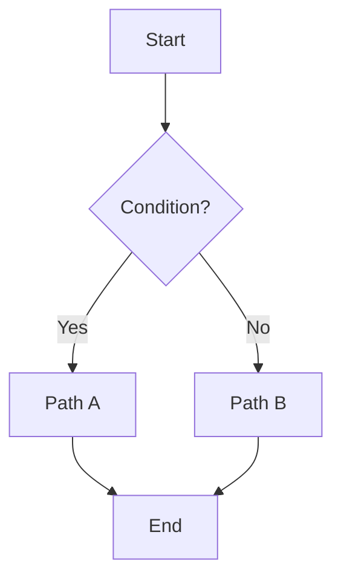

## 0) Naming, vocab & file structure
- **Filename:** `PROC – <Verb Noun>.md` (e.g., `PROC – Create Release Notes.md`)
- **Folder:** `02 Operations/Processes/` (or your preferred)
- **Controlled vocab (keep in one note):**
    - `domains:` `PKM | QA | Ops | 3D | Admin | Research`
    - `statuses:` `draft | in_review | active | deprecated | archived`
    - `roles:` `Requester | Author | Reviewer | Approver | Executor`
- **Tags (flexible, not system-critical):** `#process`, `#SOP`, `#runbook`, `#critical`, `#customer-facing`

## 🎯 Purpose
One sentence that states the outcome this process guarantees.

## 🧩 Scope & Preconditions
- Applies to …  
- Preconditions: accounts/permissions/data available

## 📦 Materials & Inputs
- …

## ▶ Steps
1. …
2. …
3. …

## 🔀 Decision Points


## 🚨 Exceptions & Rollback
- If X fails, do Y.
- Rollback steps…
## ✅ Outputs & Evidence
- Artifacts/logs to keep, where they live
## 🔎 Search & Discovery
- Keywords/synonyms (kept in `search_terms`)
- Link to glossary terms
## 📏 Quality & Metrics
- Success criteria, SLOs, check frequency
## 🧪 Test/Walkthrough
- Minimal scenario + expected results
## 📅 Review
- Frequency: {{review_frequency}} (next due auto-calculated)
- Reviewer: {{owner}} (or role)
    

## 🗒️ Run Log
|id|date|result|changes|notes|
|---|---|---|---|---|

> Tip: keep **Steps** terse; move explanations to **Notes/FAQ** sections linked at the bottom.

---

## 2) QuickAdd “New Process” (form → template)
Create a **QuickAdd Macro**:
- **Inputs:** `title`, `domain`, `roles[]`, `review_frequency`
- **File name:** `PROC – {{VALUE:title}}`
- **Template:** the master template above (Templater enabled)
- **After create:** open file and focus cursor at **Purpose**

---

## 3) Templater helpers (put in a small JS file, e.g., `_scripts/tp-utils.js`)
```js
module.exports.random = (len=4) =>
  Array.from(crypto.getRandomValues(new Uint8Array(len)))
    .map(x => (x%36).toString(36)).join('').toUpperCase();

module.exports.bump = (semver, part="patch") => {
  const [maj, min, pat] = (semver||"0.0.0").split('.').map(n=>parseInt(n||0));
  if (part==="major") return `${maj+1}.0.0`;
  if (part==="minor") return `${maj}.${min+1}.0`;
  return `${maj}.${min}.${(pat||0)+1}`;
}
```
**Version bump snippet** (add to a Templater command):
```
<%* 
const p = this.app.metadataCache.getFileCache(tp.file.find_tfile(tp.file.path)).frontmatter;
const newV = tp.user.bump(p.version || "1.0.0", "minor");
await tp.file.replace_section("version: "+p.version, "version: "+newV);
await tp.file.append("\nCHANGE_LOG: |\n  - "+tp.date.now()+": Bumped to "+newV+"\n");
_%>
```