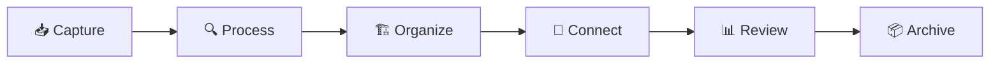

> [!orbit] Wayfinder | [[My PKM MOC]] |  [[Master PKM System Overview]] |  [[My PKM Queries]] |  [[My PKM Folders]] |  [[My PKM Tags]] | **My PKM Workflows - Global Guidelines** | [[My PKM Tasks]] | 

⬆️:: [[🏡Home]]

🗺️[[My PKM MOC]]
## 🔗Related

[[GtD - Getting Things Done]]
[[Graf]]
[[Hotkeys & Automation]]
[[Visual hotkeys]]
👌[[ICON pack]]

---


### **Klíčové procesy**
- **🌅 Ranní routine**: Inbox processing (10 min)
- **🎯 Focus workflow**: Energy-based task selection
- **🔄 Weekly review**: Projekty, archivace, cleanup
- **🧠 Recall & Reflect**: Propojování a rozvoj idejí
# My PKM Workflows - Global Guidelines
Základní procesy a best practices pro práci s PKM systémem.
## Daily Workflow
1. **Capture** - Add new notes to Inbox
2. **Process** - Review inbox and file notes appropriately
3. **Connect** - Link new notes to existing ones
4. **Review** - Check active projects and areas
## Weekly Workflow
1. **Review** - Go through all active projects
2. **Clean** - Archive completed items
3. **Plan** - Set priorities for upcoming week
4. **Maintain** - Update MOCs and index notes
## Monthly Workflow
1. **Archive** - Move completed projects to archive
2. **Reflect** - Review what worked and what didn't
3. **Reorganize** - Adjust structure if needed
4. **Backup** - Ensure vault is properly backed up
---
## Core Workflow: Capture → Process → Organize → Review → Archive

```
 [[📥inbox]] → [[🔄active]] → [[✅completed]]  → [[📦archived]] 
```

```
📥 Capture (QuickAdd / Mobile / Voice)
   ↓
🔍 Process (Daily Inbox Review, <2min rule, triage to folder)
   ↓
🏗 Organize (Linking, tagging, MOC updates, metadata fill)
   ↓
📊 Review (Daily priorities, Weekly project review, Monthly cleanup)
   ↓
📦 Archive (Move to 06 Archive, auto-add archived_date)
```
### **1. Capture (Zachycení)**
- Vše jde nejprv do **00-Inbox**
- Rychlé zachycení bez přemýšlení o organizaci
- Používej Quick Capture šablony
- Dataview pro přehled [[Performance Metrics#Capture - Souhrn|Týdenní]] nebo [[Performance Metrics#Denní|Denní]] 
### **2. Process (Zpracování)**  
- Denní Inbox processing (ráno 10 min)
- Rozhodovací strom: Co to je? Actionable? < 2 min? [[GtD - Getting Things Done#**Decision tree simplified **|Decision tree in GtD]]
- Třídění do správných složek s metadaty
### **3. Organize (Organizace)**
- Propojování nových poznámek s existujícími
- Aktualizace MOCs a tagů
- Vytváření souvislostí mezi Dots a Efforts
- Link density: průměrný počet wikilinků na poznámku  
[[Performance Metrics#List of 10 notes that have the most links.]]
### **4. Review (Revize)**
- **Denní:** Rychlý přehled priorit a úkolů
- **Týdenní:** Review projektů, archive dokončených
- **Měsíční:** Systémová údržba, cleanup
### **Review Cycles**

- **Daily**
    - Process Inbox (10 min)
    - Check Today’s tasks & priorities
    - Log reflections in Daily Note
- **Weekly**
    - Review active Efforts & MOCs
    - Update statuses & archive completed items
    - Clean [[🧹tidy]] and [[❔question]] notes
- **Monthly**
    - Structural cleanup
    - Adjust folder/tag/metadata rules
    - Backup vault & review plugin list
- **Quarterly**
    - Audit system relevance
    - Optimize templates & queries
---
## Recall & Reflect Process

### Pravidelné procesy pro udržení kvality:
- **Weekly Dots Review:** Projdi náhodné Dots, hledej propojení
- **Monthly Efforts Check:** Vyhodnoť pokrok, archivuj neaktivní
- **Quarterly System Review:** Optimalizace workflow a struktury
---
## Obecné workflow pro vault

**1. 80/20 Rule:** 80% univerzální obsah, 20% customization zones
**2. Progressive Enhancement:** Začni jednoduše, postupně rozšiřuj  
**3. Clear Documentation:** Každá customization je zdokumentovaná  
**4. Feedback Loops:** Pravidelně vyhodnocuj a zlepšuj systém  
**5. Version Control:** Sleduj změny a možnosti rollback

---
## Linking Conventions
## Internal Links
- Use `[[Note Name]]` for basic links
- Use `[[Note Name|Display Text]]` for custom display
- Use `[[Note Name#Section]]` for section links
## MOC (Map of Content) Structure
Create index notes for major topics:
- Home is already the index. And each of these are the mocs for the folders
[[🏡Home]] x [[🙃 Sidebar]]
[[00-Inbox]] - Overview of incoming notes
[[01-MOCs]] - Overview of Maps of Contents 
[[Dots]] - Overview of categorized notes
[[Efforts]] - Overview of current projects
[[Sources]] - Overview of sources
[[03-PERIODIC]] - Overview of daily notes and other journalling 
[[06-Archive]] - Overview of archived notes
## File Naming Conventions
## Standard Approach
- Use sentence case with spaces: `My Important Note`
- Avoid special characters: `/ \ : * ? " < > |`
- Use hyphens for compound concepts: `Note-Taking Methods`
## Prefixed Approach (Optional)
- Projects: `PRJ - Project Name`
- People: `PER - Person Name`
- Resources: `RES - Resource Name`
- Meeting notes: `MEET - YYYY-MM-DD - Subject`
---
### **Týdenní Maintenance workflow:** 

```markdown
1. 🧹 CLEANUP
   ├── Najdi: [[🧹tidy]] tagy
   ├── Zpracuj: [[❔question]] poznámky
   └── Aktualizuj: [[🌱develop]] obsah

2. 📊 REVIEW  
   ├── [[⏳waiting]] → check status
   ├── [[🎯priority-high]] → verify urgency
   └── [[⚗️experiment]] → evaluate results
```

**Maintenance strategy:**
- Plugin Update Tracker pro sledování změn
- Pravidelná synchronizace plugin listu mezi vaulty
- Dokumentace customizací v [[💾Changelog]]
- Zapisování vylepšováku do [[💾Backlog]]
---
## Vault-Specific Guidelines

*Přizpůsobení pro tento vault:*

- [ ] Definovat specifické rutiny
- [ ] Upravit review cykly  
- [ ] Přidat specializované workflow

---
