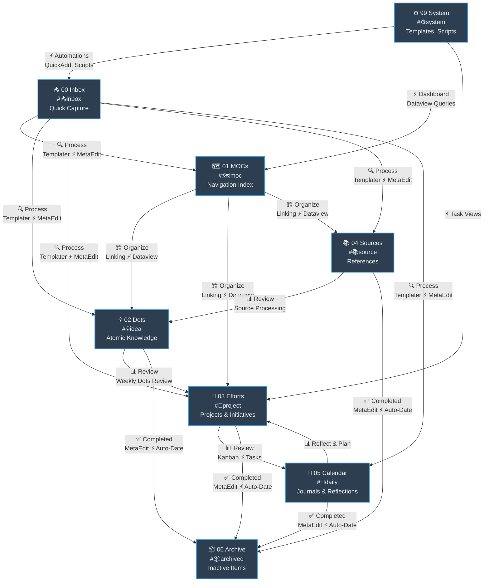

```mermaid
graph TD

%% ===== NODES =====
A[📥 00 Inbox<br/>#📥inbox<br/>Quick Capture]:::folder
B[🗺️ 01 MOCs<br/>#🗺️moc<br/>Navigation Index]:::folder
C[💡 02 Dots<br/>#💡idea<br/>Atomic Knowledge]:::folder
D[🚀 03 Efforts<br/>#🚀project<br/>Projects & Initiatives]:::folder
E[📚 04 Sources<br/>#📚source<br/>References]:::folder
F[📅 05 Calendar<br/>#📅daily<br/>Journals & Reflections]:::folder
G[📦 06 Archive<br/>#📦archived<br/>Inactive Items]:::folder
H[⚙️ 99 System<br/>#⚙️system<br/>Templates, Scripts]:::folder

%% ===== WORKFLOW EDGES =====
A -->|🔍 Process<br/>Templater ⚡ MetaEdit| B
A -->|🔍 Process<br/>Templater ⚡ MetaEdit| C
A -->|🔍 Process<br/>Templater ⚡ MetaEdit| D
A -->|🔍 Process<br/>Templater ⚡ MetaEdit| E
A -->|🔍 Process<br/>Templater ⚡ MetaEdit| F

B -->|🏗 Organize<br/>Linking ⚡ Dataview| C
B -->|🏗 Organize<br/>Linking ⚡ Dataview| D
B -->|🏗 Organize<br/>Linking ⚡ Dataview| E

C -->|📊 Review<br/>Weekly Dots Review| D
D -->|📊 Review<br/>Kanban ⚡ Tasks| F
E -->|📊 Review<br/>Source Processing| C

F -->|📊 Reflect & Plan| D

%% ARCHIVE
D -->|✅ Completed<br/>MetaEdit ⚡ Auto-Date| G
C -->|✅ Completed<br/>MetaEdit ⚡ Auto-Date| G
E -->|✅ Completed<br/>MetaEdit ⚡ Auto-Date| G
F -->|✅ Completed<br/>MetaEdit ⚡ Auto-Date| G

%% SYSTEM LINKS
H -->|⚡ Automations<br/>QuickAdd, Scripts| A
H -->|⚡ Dashboard<br/>Dataview Queries| B
H -->|⚡ Task Views| D

%% ===== STYLES =====
classDef folder fill:#2c3e50,stroke:#3498db,stroke-width:2px,color:#ecf0f1;

```
