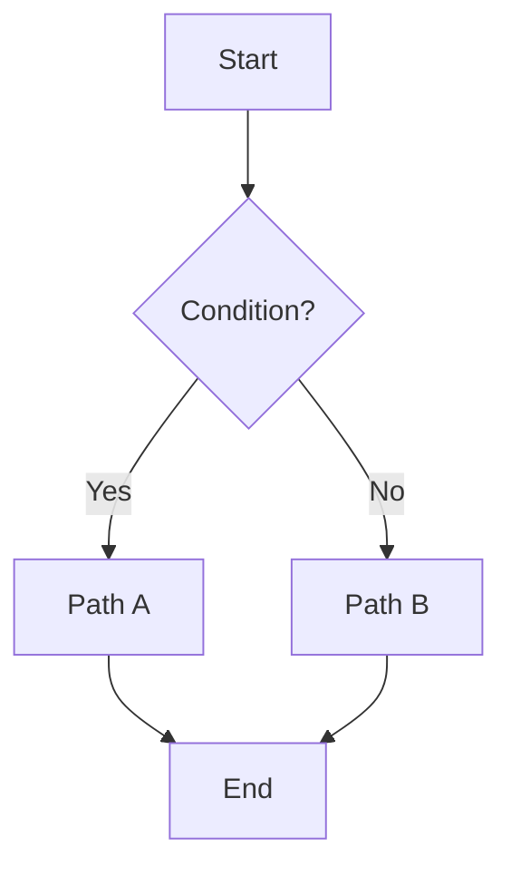

## 🎯 Purpose
One sentence that states the outcome this process guarantees.

## 🧩 Scope & Preconditions
- Applies to …  
- Preconditions: accounts/permissions/data available

## 📦 Materials & Inputs
- …

## ▶ Steps
1. …
2. …
3. …

## 🔀 Decision Points

## 🚨 Exceptions & Rollback
- If X fails, do Y.
- Rollback steps…
## ✅ Outputs & Evidence
- Artifacts/logs to keep, where they live
## 🔎 Search & Discovery
- Keywords/synonyms (kept in `search_terms`)
- Link to glossary terms
## 📏 Quality & Metrics
- Success criteria, SLOs, check frequency
## 🧪 Test/Walkthrough
- Minimal scenario + expected results
## 📅 Review
- Frequency: {{review_frequency}} (next due auto-calculated)
- Reviewer: {{owner}} (or role)
## 🗒️ Run Log
|id|date|result|changes|notes|
|---|---|---|---|---|
> Tip: keep **Steps** terse; move explanations to **Notes/FAQ** sections linked at the bottom.
