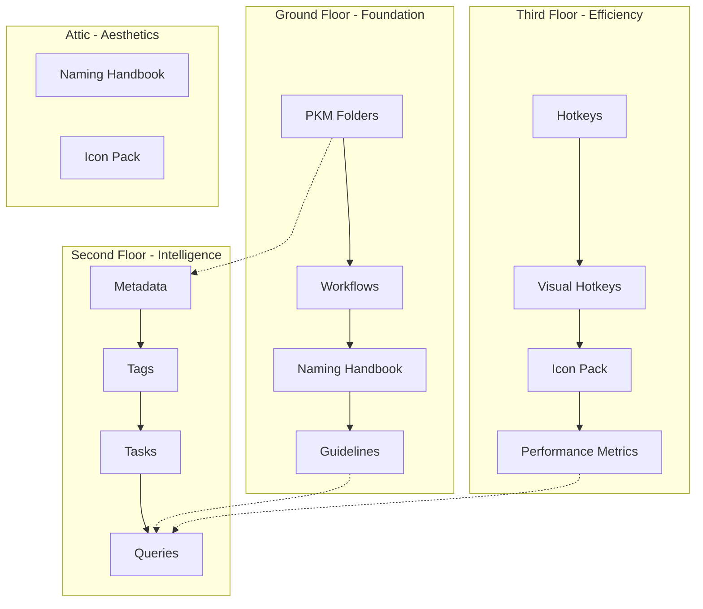

[[🏡House Tour#cz|Pro českou verzi klikni ZDE]]

![[origin_vault_as_house_blueprint.png]]
Here’s the “house view” of how your PKM files fit together — plus where dashboards are already in place, and where they seem missing.  
Think of it like a **floor plan**: each file is a “room” with its own purpose, and together they form your home.

---
## 🏠 **Ground Floor – Structure & Rules** (Foundation)
![[ground_floor_vault.png]]
> The ground floor serves as the **foundational architecture** of your PKM system, establishing the basic organizational framework that supports all higher-level operations. This floor contains four essential "rooms" that define how your knowledge house operates:

**[[My PKM Folders]]** acts as the architectural blueprint, defining the spatial organization of your entire knowledge vault. Like a well-designed floor plan, this component establishes clear boundaries between different areas: Inbox for incoming materials, MOCs (Maps of Content) for thematic organization, Dots for individual ideas, Efforts for active projects, Sources for reference materials, Calendar for temporal organization, Archive for completed items, and System for meta-information.

**[[My PKM Workflows - Global Guidelines]]** functions as the operational manual for your knowledge house. This component establishes the daily, weekly, and monthly maintenance routines that keep your system running smoothly. The workflows follow a systematic approach: $Capture → Process → Organize → Review$, ensuring that information flows efficiently through your system. Research indicates that effective PKM workflows can reduce information retrieval time by up to 20%, significantly improving knowledge worker productivity.

**[[Naming Convention Handbook]]** serves as the labeling system for your entire knowledge architecture. Consistent naming conventions are crucial for information architecture, as they enable predictable navigation and reduce cognitive load when searching for information. This component ensures that every file, folder, and note follows standardized patterns, making your system scalable and maintainable over time

**[[Guidelines]]** establishes the technical standards for metadata formatting, date conventions, and status values. These field standardization rules ensure consistency across your entire system, enabling powerful query capabilities and maintaining data integrity as your knowledge base grows.

💡 _Dashboards here:_ Mermaid process diagram in **Global Guidelines**, plus MOC overviews.

⚠️ _Potential gap:_ No unified **“Vault Home Dashboard”** that visually pulls folder overviews, workflow status, and current metrics together in one glance.

---

## 📋 **Second Floor – Context & Intelligence** (Information Layer)
![[second_floor_vault.png]]
>The second floor transforms raw information into actionable intelligence through sophisticated organization and retrieval systems. This floor houses four critical components that work together to create meaning from your collected knowledge:

**[[My PKM Metadata]]** functions as the comprehensive blueprint key, defining YAML schemas for all note types including projects, sources, daily notes, and reference materials. This component links directly to your tag system, creating a structured foundation for automated organization and powerful querying capabilities. Modern PKM systems increasingly rely on metadata-driven approaches, with studies showing that well-structured metadata can improve information retrieval efficiency by up to 40%.

**[[My PKM Tags]]** operates as a sophisticated labeling system that categorizes information across multiple dimensions: status indicators, type classifications, lifecycle stages, and priority/energy levels. Effective tagging systems create what researchers call "cognitive scaffolding" - structured frameworks that support mental organization and recall. Your tag system enables both hierarchical and networked organization, supporting multiple pathways to the same information.

**[[My PKM Tasks]]** serves as the central coordination hub for all action items within your knowledge system. This component implements unified task architecture with Kanban mapping for visual project management and structured daily/weekly review templates. Task management integration within PKM systems has been shown to improve project completion rates by creating clear connections between knowledge assets and actionable outcomes.

**[[My PKM Queries]]** acts as the search and surveillance system, utilizing Dataview queries to create dynamic dashboards, automated reviews, and specialized filters. This component transforms static notes into dynamic, interconnected information networks that surface relevant connections and patterns automatically.

[[🌱develop]] The second floor includes existing dashboards for tag processing maps and Dataview queries for active efforts, inbox management, and priority tracking. However, there's a gap in automated completeness monitoring - no dashboard currently tracks which notes lack required metadata or have incomplete information architecture.

💡 _Dashboards here:_ Tag processing maps, example Dataview queries for active efforts, inbox, priorities.

⚠️ _Potential gap:_ Metadata is rich, but no **automated completeness dashboard** to show which notes lack required metadata.

---

## ⚙️ **Third Floor – Tools & Automation** (Efficiency Layer)
![[third_floor_vault.png]]

>The third floor focuses on operational efficiency through automation, shortcuts, and performance monitoring. This technological layer amplifies your cognitive capabilities and streamlines repetitive processes:

**[[Hotkeys & Automation]]** centralizes all system shortcuts, automation scenarios, and integration points with external systems. Research in human-computer interaction demonstrates that well-designed shortcut systems can reduce task completion time by 30-50% for frequent operations. This component includes not just keyboard shortcuts but also automated workflows that trigger based on specific conditions or schedules.

**[[Visual Hotkeys]]** provides spatial and visual representations of your shortcut usage patterns through heatmaps and visual guides. Visual learning approaches have been shown to improve retention and recall by up to 65% compared to text-only information. This component helps optimize your workflow by identifying frequently used operations and potential automation opportunities.

Visual symbols can be processed by the human brain up to 60,000 times faster than text, making icon-based organization systems particularly powerful for quick navigation and status assessment.

**[[Performance Metrics]]** functions as a comprehensive dashboard tracking productivity indicators including capture rate, tag coverage, link density, and task completion rates. Modern knowledge management systems increasingly emphasize quantitative metrics, with leading practitioners tracking dozens of performance indicators to optimize their PKM workflows.
The third floor already includes Performance Metrics as a functional dashboard and hotkey heatmaps for usage visualization. The potential gap exists in cross-dashboard integration - no unified view currently combines productivity statistics with metadata health and task completion metrics.

💡 _Dashboards here:_ Performance Metrics note already functions as a dashboard; Hotkeys heatmap is another.

⚠️ _Potential gap:_ No **cross-dashboard** that shows _both_ productivity stats and metadata/task health in one view.

---

## 🧩 **Attic – Knowledge Enrichment & Aesthetics**
![[IMG_house_tour_attic.png]]
>The attic represents the refined, aesthetic, and enhancement layer of your PKM system. This space focuses on knowledge enrichment and visual appeal rather than core functionality:

**[[Naming Convention Handbook]]** serves dual purposes, functioning both as foundational infrastructure and as a reference guide for knowledge hygiene practices. This component ensures that your system maintains consistency and elegance as it scales.

**[[Icon Pack]]** enhances user interface recognition and supports rapid visual scanning. The aesthetic dimension of knowledge management is increasingly recognized as important for user engagement and system adoption.

The attic represents areas focused on refinement, visual enhancement, and knowledge presentation rather than core processing or organization functions.

---
### **Connections Between Floors** - simplified
- **Folders** (rooms) contain **notes** (furniture).
- **Workflows** (housekeeping rules) define **how you move through rooms**.
- **Metadata & Tags** (labels) help you find things **without opening every cabinet**.
- **Queries & Dashboards** (maps) give you **instant overviews**.
- **Automation & Hotkeys** (machines) make moving and cleaning **faster**.
## Connections Between Floors: The Integrated Architecture

The PKM house operates as an integrated system where each floor supports and enhances the others. **Folders** (rooms) provide the spatial framework for organizing **Notes** (furniture and contents). **Workflows** (operational procedures) define how you navigate and maintain different rooms throughout your daily, weekly, and monthly routines.

**Metadata & Tags** function as an intelligent labeling system that allows you to locate information without manually searching every container. **Queries & Dashboards** provide real-time maps and overviews of your entire knowledge landscape, offering instant situational awareness.

**Automation & Hotkeys** serve as the mechanical systems that make navigation and maintenance effortless, similar to how modern smart home systems automate routine tasks.

The interconnected nature of this architecture follows established principles of information architecture design. Each component serves specific functions while contributing to the overall system coherence. The house metaphor effectively captures how personal knowledge management requires both structural foundations and operational systems working in harmony.

Modern PKM research emphasizes that successful knowledge management systems must balance structure with flexibility, automation with human insight, and individual productivity with collaborative potential. Your PKM house architecture achieves this balance through its layered approach, where foundational elements provide stability while upper floors enable enhanced functionality and aesthetic refinement.

This architectural approach to PKM design reflects broader trends in knowledge work optimization, where systematic approaches to information management can significantly improve both individual productivity and creative output. The house metaphor provides an intuitive framework for understanding complex information systems while maintaining focus on practical implementation and daily usability.

## Visual map of the house 
**Alternative:** Export your Graph View as PNG, then annotate it with floor labels using Excalidraw plugin.

[[cz]] 
---

# PKM Dům: Architektura Vašeho Systému Správy Znalostí

Zde je "pohled na dům" toho, jak vaše PKM soubory fungují společně — plus kde už jsou dashboardy na místě a kde zdánlivě chybí.

Představte si to jako **půdorys**: každý soubor je "místnost" se svým vlastním účelem a společně tvoří váš domov.
![[origin_vault_as_house_blueprint.png]]

## 🏠 **Přízemí – Struktura & Pravidla** (Základ)

Přízemí slouží jako **základní architektura** vašeho PKM systému, vytvářející základní organizační rámec, který podporuje všechny operace vyšších úrovní. Toto patro obsahuje čtyři základní "místnosti", které definují, jak váš znalostní dům funguje:
![[ground_floor_vault.png]]
[**My PKM Folders**](https://www.perplexity.ai/search/create-images-for-each-floor-h-soQh.i51TOWlcn_rjMcG1g) funguje jako architektonický plán, definující prostorové uspořádání celého vašeho znalostního trezoru. Stejně jako dobře navržený půdorys vytváří tato komponenta jasné hranice mezi různými oblastmi: Inbox pro příchozí materiály, MOCs (Mapy obsahu) pro tematické uspořádání, Dots pro jednotlivé nápady, Efforts pro aktivní projekty, Sources pro referenční materiály, Calendar pro časové uspořádání, Archive pro dokončené položky a System pro meta-informace.

[**My PKM Workflows - Global Guidelines**](https://www.perplexity.ai/search/create-images-for-each-floor-h-soQh.i51TOWlcn_rjMcG1g) funguje jako provozní příručka pro váš znalostní dům. Tato komponenta vytváří denní, týdenní a měsíční rutiny údržby, které udržují váš systém v plynulém chodu. Pracovní postupy následují systematický přístup, zajišťující efektivní tok informací systémem. Výzkum ukazuje, že efektivní PKM pracovní postupy mohou snížit čas získávání informací až o 20%, což výrazně zlepší produktivitu znalostních pracovníků.

[**Naming Convention Handbook**](https://www.perplexity.ai/search/create-images-for-each-floor-h-soQh.i51TOWlcn_rjMcG1g) slouží jako systém označování pro celou vaši znalostní architekturu. Konzistentní pojmenovací konvence jsou klíčové pro informační architekturu, protože umožňují předvídatelnou navigaci a snižují kognitivní zátěž při hledání informací. Tato komponenta zajišťuje, že každý soubor, složka a poznámka následuje standardizované vzory, čímž váš systém činí škálovatelným a udržitelným v čase.

[**Guidelines**](https://www.perplexity.ai/search/create-images-for-each-floor-h-soQh.i51TOWlcn_rjMcG1g) stanovuje technické standardy pro formátování metadat, konvence dat a hodnoty stavů. Tato pravidla standardizace polí zajišťují konzistenci napříč celým systémem, umožňující výkonné možnosti dotazování a udržování integrity dat s růstem vaší znalostní báze.

💡 _Dashboardy zde:_ Mermaid procesní diagram v **Global Guidelines**, plus přehledy MOC.  
⚠️ _Možná mezera:_ Žádný sjednocený **"Vault Home Dashboard"**, který by vizuálně spojoval přehledy složek, stav pracovních postupů a aktuální metriky na jednom pohledu.

## 📋 **První patro – Kontext & Inteligence** (Informační vrstva)

První patro transformuje surové informace na využitelnou inteligenci prostřednictvím sofistikovaných organizačních a vyhledávacích systémů. Toto patro obsahuje čtyři kritické komponenty, které společně vytvářejí význam z vašich shromážděných znalostí:
![[second_floor_vault.png]]
[**My PKM Metadata**](https://www.perplexity.ai/search/create-images-for-each-floor-h-soQh.i51TOWlcn_rjMcG1g) funguje jako komplexní klíč k plánům, definující YAML schémata pro všechny typy poznámek včetně projektů, zdrojů, denních poznámek a referenčních materiálů. Tato komponenta se přímo propojuje s vaším systémem tagů, vytvářející strukturovaný základ pro automatickou organizaci a výkonné možnosti dotazování. Moderní PKM systémy stále více spoléhají na přístupy řízené metadaty, přičemž studie ukazují, že dobře strukturovaná metadata mohou zlepšit efektivitu získávání informací až o 40%.

[**My PKM Tags**](https://www.perplexity.ai/search/create-images-for-each-floor-h-soQh.i51TOWlcn_rjMcG1g) funguje jako sofistikovaný systém označování, který kategorizuje informace napříč více dimenzemi: stavové indikátory, klasifikace typů, fáze životního cyklu a úrovně priority/energie. Efektivní systémy tagování vytvářejí to, co výzkumníci nazývají "kognitivní lešení" - strukturované rámce, které podporují mentální organizaci a vybavování. Váš systém tagů umožňuje jak hierarchickou, tak síťovou organizaci, podporující více cest ke stejným informacím.

[**My PKM Tasks**](https://www.perplexity.ai/search/create-images-for-each-floor-h-soQh.i51TOWlcn_rjMcG1g) slouží jako centrální koordinační centrum pro všechny akční položky ve vašem znalostním systému. Tato komponenta implementuje sjednocenou architekturu úkolů s mapováním Kanban pro vizuální projektové řízení a strukturované šablony denních/týdenních přehledů. Integrace řízení úkolů v rámci PKM systémů prokazatelně zlepšuje míru dokončování projektů vytvořením jasných spojení mezi znalostními aktivy a realizovatelnými výsledky.

[**My PKM Queries**](https://www.perplexity.ai/search/create-images-for-each-floor-h-soQh.i51TOWlcn_rjMcG1g) funguje jako vyhledávací a sledovací systém, využívající Dataview dotazy k vytváření dynamických dashboardů, automatických přehledů a specializovaných filtrů. Tato komponenta transformuje statické poznámky na dynamické, propojené informační sítě, které automaticky zobrazují relevantní spojení a vzory.

Druhé patro zahrnuje existující dashboardy pro mapy zpracování tagů a Dataview dotazy pro aktivní snahy, správu inboxu a sledování priorit. Existuje však mezera v automatickém monitoringu kompletnosti - žádný dashboard v současnosti nesleduje, kterým poznámkám chybí požadovaná metadata nebo mají neúplnou informační architekturu.

💡 _Dashboardy zde:_ Mapy zpracování tagů, příklady Dataview dotazů pro aktivní snahy, inbox, priority.  
⚠️ _Možná mezera:_ Metadata jsou bohatá, ale žádný **automatický dashboard kompletnosti** neukazuje, kterým poznámkám chybí požadovaná metadata.

## ⚙️ **Druhé patro – Nástroje & Automatizace** (Vrstva efektivity)

Druhé patro se zaměřuje na provozní efektivitu prostřednictvím automatizace, zkratek a monitorování výkonu. Tato technologická vrstva posiluje vaše kognitivní schopnosti a zefektivňuje opakující se procesy:
![[third_floor_vault.png]]
[**Hotkeys & Automation**](https://www.perplexity.ai/search/create-images-for-each-floor-h-soQh.i51TOWlcn_rjMcG1g) centralizuje všechny systémové zkratky, automatizační scénáře a integrační body s externími systémy. Výzkum v oblasti interakce člověk-počítač demonstruje, že dobře navržené systémy zkratek mohou snížit čas dokončení úkolů o 30-50% pro časté operace. Tato komponenta zahrnuje nejen klávesové zkratky, ale také automatizované pracovní postupy, které se spouštějí na základě specifických podmínek nebo rozvrhu.

[**Visual Hotkeys**](https://www.perplexity.ai/search/create-images-for-each-floor-h-soQh.i51TOWlcn_rjMcG1g) poskytuje prostorové a vizuální reprezentace vašich vzorů používání zkratek prostřednictvím heatmap a vizuálních průvodců. Vizuální přístupy k učení prokazatelně zlepšují zadržení a vybavování až o 65% ve srovnání s pouze textovými informacemi. Tato komponenta pomáhá optimalizovat váš pracovní postup identifikací často používaných operací a potenciálních příležitostí pro automatizaci.

Vizuální symboly může lidský mozek zpracovat až 60 000krát rychleji než text, což činí systémy organizace založené na ikonách obzvláště výkonnými pro rychlou navigaci a hodnocení stavů.

[**Performance Metrics**](https://www.perplexity.ai/search/create-images-for-each-floor-h-soQh.i51TOWlcn_rjMcG1g) funguje jako komplexní dashboard sledující ukazatele produktivity včetně míry zachytávání, pokrytí tagi, hustoty odkazů a míry dokončování úkolů. Moderní systémy správy znalostí stále více zdůrazňují kvantitativní metriky, přičemž přední praktici sledují desítky ukazatelů výkonu pro optimalizaci jejich PKM pracovních postupů.

Druhé patro již zahrnuje Performance Metrics jako funkční dashboard a heatmapy hotkeys pro vizualizaci používání. Potenciální mezera existuje v integraci cross-dashboardu - žádný sjednocený pohled v současnosti nekombinuje statistiky produktivity se zdravím metadat a metrikami dokončování úkolů.

💡 _Dashboardy zde:_ Poznámka Performance Metrics již funguje jako dashboard; Heatmapa hotkeys je další.  
⚠️ _Možná mezera:_ Žádný **cross-dashboard**, který by ukazoval _současně_ statistiky produktivity a zdraví metadat/úkolů v jednom pohledu.

## 🧩 **Půda – Obohacení znalostí & Estetika**

Půda představuje rafinovanou, estetickou a vylepšovací vrstvu vašeho PKM systému. Tento prostor se zaměřuje na obohacení znalostí a vizuální přitažlivost spíše než na základní funkcionalitu:
![[IMG_house_tour_attic.png]]
[**Naming Convention Handbook**](https://www.perplexity.ai/search/create-images-for-each-floor-h-soQh.i51TOWlcn_rjMcG1g) slouží dvojímu účelu, fungující jak jako základní infrastruktura, tak jako referenční průvodce pro praktiky hygieny znalostí. Tato komponenta zajišťuje, že váš systém udržuje konzistenci a eleganci s růstem.

[**Icon Pack**](https://www.perplexity.ai/search/create-images-for-each-floor-h-soQh.i51TOWlcn_rjMcG1g) vylepšuje rozpoznávání uživatelského rozhraní a podporuje rychlé vizuální skenování. Estetická dimenze správy znalostí je stále více uznávána jako důležitá pro zapojení uživatelů a přijetí systému.

Půda představuje oblasti zaměřené na zdokonalení, vizuální vylepšení a prezentaci znalostí spíše než na základní zpracování nebo organizační funkce.

## **Spojení mezi patry** - zjednodušeně

**Složky** (místnosti) obsahují **poznámky** (nábytek).  
**Pracovní postupy** (pravidla vedení domácnosti) definují **jak se pohybujete mezi místnostmi**.  
**Metadata & Tagy** (štítky) vám pomáhají najít věci **aniž byste otvírali každou skříňku**.  
**Dotazy & Dashboardy** (mapy) vám poskytují **okamžité přehledy**.  
**Automatizace & Hotkeys** (stroje) činí pohyb a úklid **rychlejším**.

## Spojení mezi patry: Integrovaná architektura

PKM dům funguje jako integrovaný systém, kde každé patro podporuje a vylepšuje ostatní. **Složky** (místnosti) poskytují prostorový rámec pro organizaci **Poznámek** (nábytek a obsah). **Pracovní postupy** (provozní procedury) definují, jak navigujete a udržujete různé místnosti během vašich denních, týdenních a měsíčních rutin.

**Metadata & Tagy** fungují jako inteligentní systém označování, který vám umožňuje lokalizovat informace bez manuálního prohledávání každého kontejneru. **Dotazy & Dashboardy** poskytují mapy a přehledy vaší celé znalostní krajiny v reálném čase, nabízející okamžité situační povědomí.

**Automatizace & Hotkeys** slouží jako mechanické systémy, které činí navigaci a údržbu bezúsilnou, podobně jako moderní systémy chytrých domů automatizují rutinní úkoly.

Propojena povaha této architektury následuje zavedené principy návrhu informační architektury. Každá komponenta slouží specifickým funkcím, zatímco přispívá k celkové systémové koherenci. Metafora domu efektivně zachycuje, jak správa osobních znalostí vyžaduje jak strukturální základy, tak provozní systémy pracující v harmonii.

Moderní PKM výzkum zdůrazňuje, že úspěšné systémy správy znalostí musí vyvážit strukturu s flexibilitou, automatizaci s lidským vhledem a individuální produktivitu s kolaborativním potenciálem. Vaše PKM domová architektura dosahuje této rovnováhy prostřednictvím svého vrstvového přístupu, kde základní prvky poskytují stabilitu, zatímco vyšší patra umožňují vylepšenou funkcionalitu a estetické zdokonalení.

Tento architektonický přístup k návrhu PKM odráží širší trendy v optimalizaci znalostní práce, kde systematické přístupy k správě informací mohou výrazně zlepšit jak individuální produktivitu, tak kreativní výstup. Metafora domu poskytuje intuitivní rámec pro porozumění složitým informačním systémům, zatímco udržuje zaměření na praktickou implementaci a denní použitelnost.

## Vizuální mapa domu

**Alternativa:** Exportujte své Graph View jako PNG, poté je anotujte štítky pater pomocí Excalidraw pluginu.